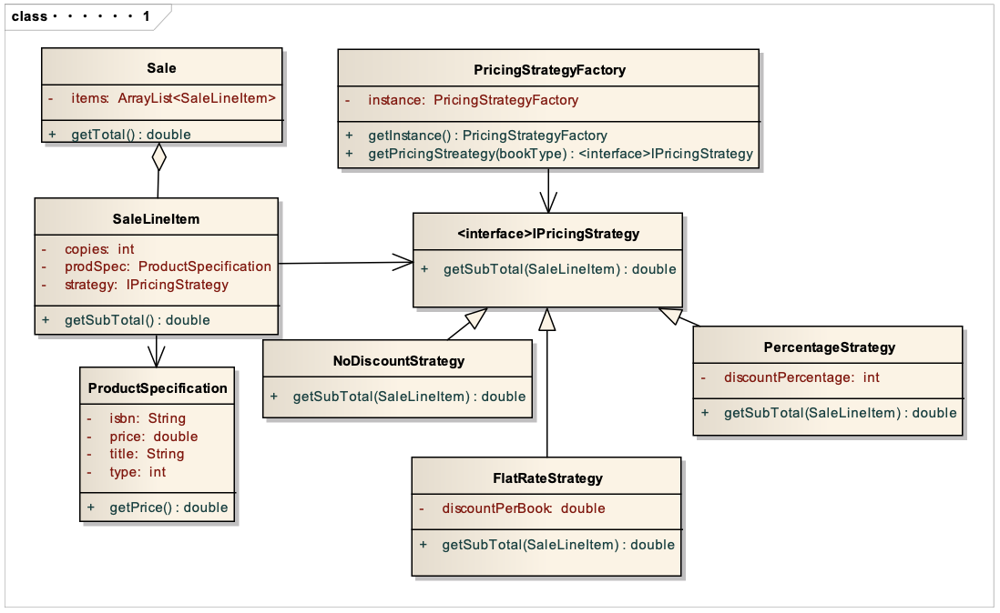
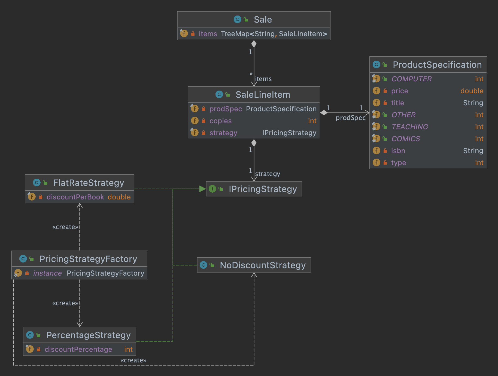
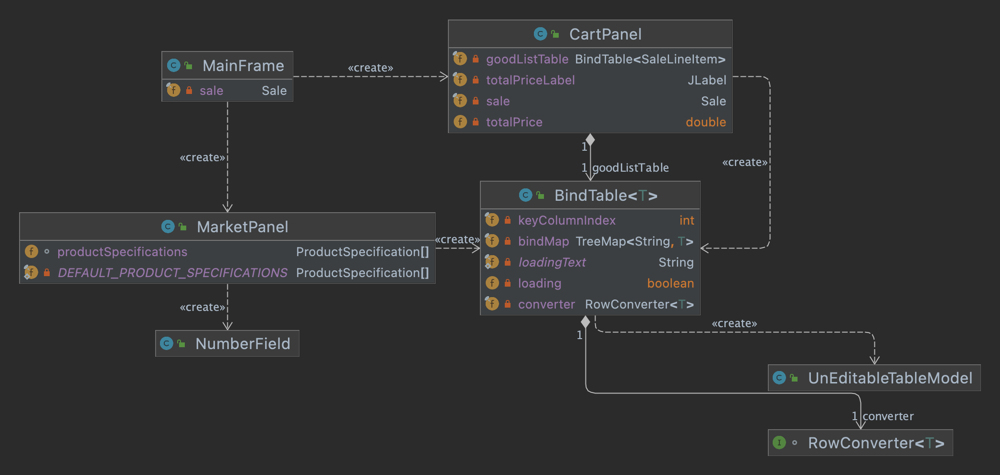
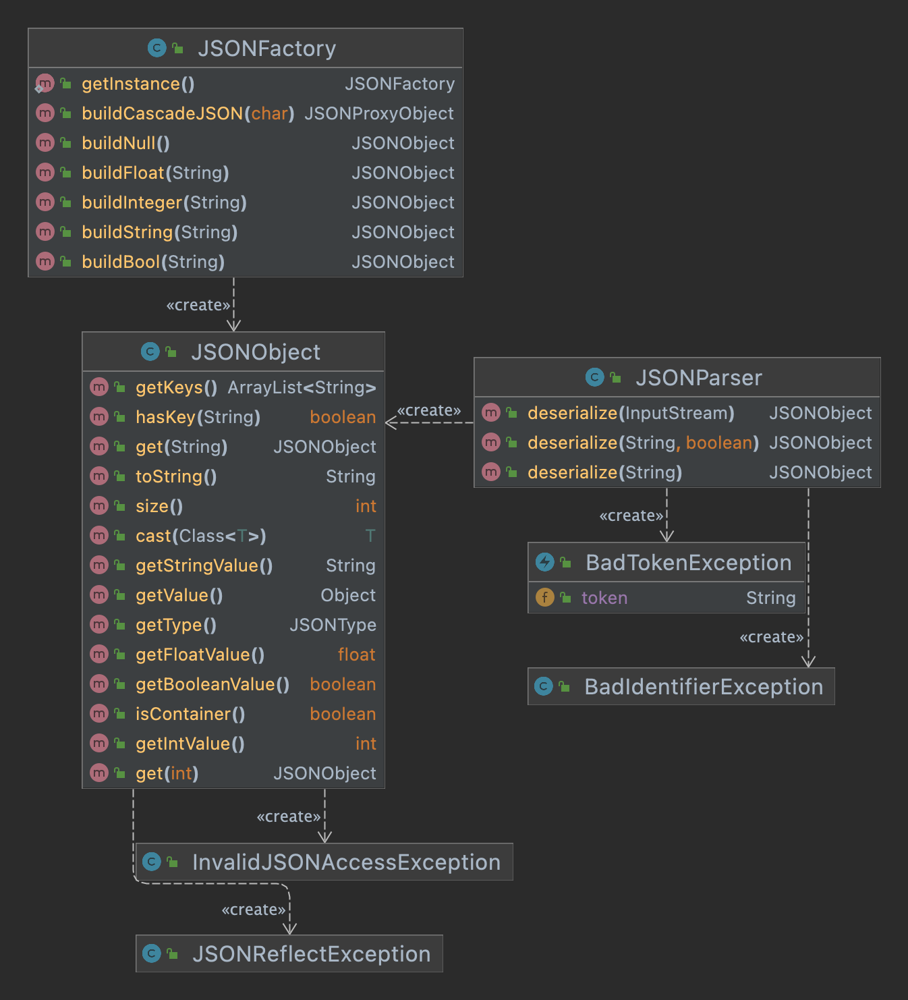
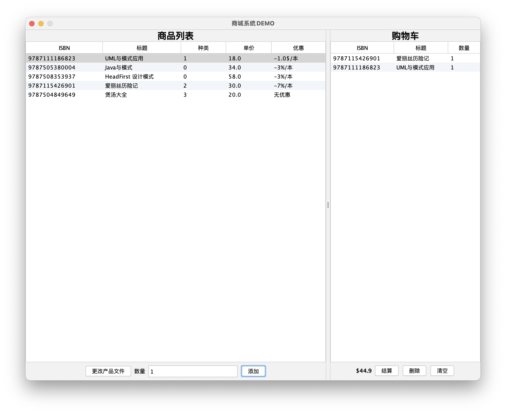
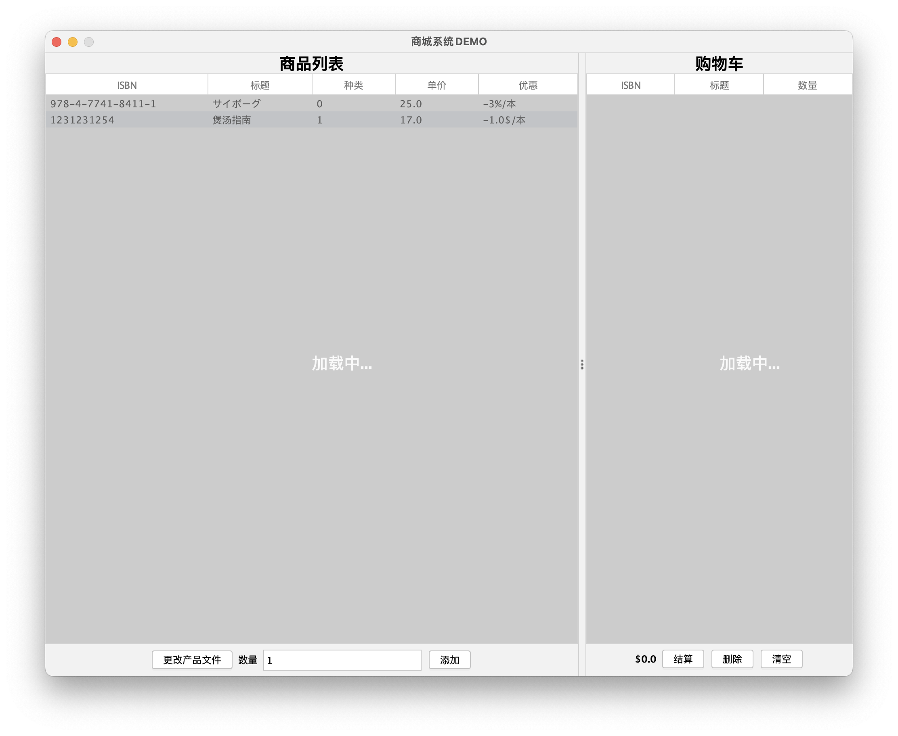
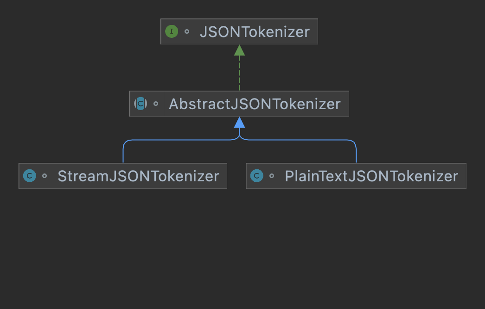
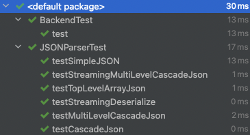

<div class="cover" style="page-break-after:always;font-family:方正公文仿宋;width:100%;height:100%;border:none;margin: 0 auto;text-align:center;">
    <div style="width:60%;margin: 0 auto;height:0;padding-bottom:10%;">
        </br>
        
    </div>
    </br></br></br></br></br>
    <div style="width:60%;margin: 0 auto;height:0;padding-bottom:40%;">
        
	</div>
    </br></br></br></br></br></br></br></br>
    <span style="font-family:华文黑体Bold;text-align:center;font-size:20pt;margin: 10pt auto;line-height:30pt;font-weight:bold">Java面向对象程序设计实践大作业</span>
    <p style="text-align:center;font-size:14pt;margin: 0 auto">设计模式在购物车的实践 </p>
    </br>
    </br>
    <table style="border:none;text-align:center;width:72%;font-family:仿宋;font-size:14px; margin: 0 auto;">
    <tbody style="font-family:方正公文仿宋;font-size:12pt;">
    	<tr style="font-weight:normal;"> 
    		<td style="width:20%;text-align:right;">题　　目</td>
    		<td style="width:2%">：</td> 
    		<td style="width:40%;font-weight:normal;border-bottom: 1px solid;text-align:center;font-family:华文仿宋"> 设计模式在购物车的实践</td>     </tr>
    	<tr style="font-weight:normal;"> 
    		<td style="width:20%;text-align:right;">授课教师</td>
    		<td style="width:2%">：</td> 
    		<td style="width:40%;font-weight:normal;border-bottom: 1px solid;text-align:center;font-family:华文仿宋">李劼 </td>     </tr>
    	<tr style="font-weight:normal;"> 
    		<td style="width:20%;text-align:right;">姓　　名</td>
    		<td style="width:2%">：</td> 
    		<td style="width:40%;font-weight:normal;border-bottom: 1px solid;text-align:center;font-family:华文仿宋"> 胡崇浩</td>     </tr>
    	<tr style="font-weight:normal;"> 
    		<td style="width:20%;text-align:right;">学　　号</td>
    		<td style="width:2%">：</td> 
    		<td style="width:40%;font-weight:normal;border-bottom: 1px solid;text-align:center;font-family:华文仿宋">2019211957 </td>     </tr>
    	<tr style="font-weight:normal;"> 
    		<td style="width:20%;text-align:right;">班　　级</td>
    		<td style="width:%">：</td> 
    		<td style="width:40%;font-weight:normal;border-bottom: 1px solid;text-align:center;font-family:华文仿宋"> 2020211321</td>     </tr>
    	<tr style="font-weight:normal;"> 
    		<td style="width:20%;text-align:right;">日　　期</td>
    		<td style="width:2%">：</td> 
    		<td style="width:40%;font-weight:normal;border-bottom: 1px solid;text-align:center;font-family:华文仿宋">2022年6月25日</td>     </tr>
    </tbody>              
    </table>
</div>

<!-- 注释语句：导出PDF时会在这里分页 -->

# 设计模式在购物车的实践

<center><div style='height:2mm;'></div><div style="font-family:华文楷体;font-size:14pt;">胡崇浩，2019211957 （学号）</div></center>
<center><span style="font-family:华文楷体;font-size:9pt;line-height:9mm">北京邮电大学计算机学院（国家示范性软件学院）</span>
</center>
<div>
<div style="width:52px;float:left; font-family:方正公文黑体;">简   介：</div> 
<div style="overflow:hidden; font-family:华文楷体;">在本次期末作业中，我基于JDK1.8的基础库开发了一个功能较为完善的购物车系统，同时从零开始使用多种设计模式开发了一个可反射的JSON解析器用于解析可变的产品信息于实体类中。</div>
</div>
<div>
<div style="width:52px;float:left; font-family:方正公文黑体;">关键词：</div> 
<div style="overflow:hidden; font-family:华文楷体;">面向对象；设计模式；JSON解析器；Swing</div>
</div>

## 概览

### 任务描述

​ 假设现在要设计一个贩卖各类书籍的电子商务网站的购物车系统。对所有的教材类图书
实行每本一元的折扣；对连环画类图书提供每本7%的促销折扣；而对非教材类的计算机图书有3%的折扣；对其余书没有折扣。使用策略模式、工厂模式、单子模式进行设计，类图如下。



<center><strong>图 1  需求中给出的基础类图</strong></center>

​ 同时作为附加要求，需要实现可交互的用户图形界面。

### 开发环境

- macOS Monterey 12.4
- AdoptOpenJDK(HotSpot) 1.8.0_292
- IntelliJ IDEA 2022.1.2 (Ultimate Edition)
- Apache Maven 3.8.6
- Git version 2.32.1 (Apple Git-133)

## 需求分析

**基本需求** 对于`1.1`节中的需求，我们只需要对简单地按照类图进行实现即可，而对于没有给出实现细节的用户图形界面，提出如下的几点功能实现：

1. 用户只读访问商场售卖的商品，商品展示`ProductSpecification`中的所有信息，并且以`isbn`作为唯一标识。
2. 用户可将商场售卖的商品添加至购物车，并且实时显示购物车中的商品总价格。
3. 允许用户对购物车中的商品进行结算、清空、删除等操作。

**附加需求** 基于该程序的实现复杂度过低，并且对于Java的特性展示不够全面，添加了如下的需求：

1. 允许用户自定义添加商品（以配置文件形式）
2. 高效流式解析JSON文件

## 模块介绍

​ 将项目按照各自的功能划分为如下的四个模块，并且绘制了各个模块的UML图：

- **backend** 后端模块，主要负责商城、购物车数据结构实现，如**图2**。
- **gui** 用户图形界面模块，主要是各种继承自`Swing`和`awt`的模块类，用于便利地展示用户图形界面，如**图3**。
- **tools** 工具模块，主要包括了自己编写的JSON解析器，如**图4**。
- **Application** 用户程序入口。

​ 程序启动的时候，先通过`Application`用户程序入口进入主程序，初始化用户窗口类`MainFrame`，该类进一步划分为左右两个`JPanel`，具体实现为两个继承自`JPanel`的实体类`MarketPanel`
商城界面和`CartPanel`购物车界面，再由这两个Panel初始化自己的各个细分子模块对象和GUI交互内容。

​        **gui**模块和**backend**模块在`MarketPanel`和`CartPanel`两个类中发生交互：

- 在`MarketPanel`中将`ProductSpecification`存储为成员对象，在初始化和重新载入商城内容的时候会更新数组内容并且根据数组内容更新用户界面。
- 在`CartPanel`中将`Sale`存储为成员对象，在向购物车添加物品或者从购物车删除物品时会同步`Sale`的状态，以实现实时结算的效果。

​        **gui**模块和**tool**模块在`MarketPanel`中发生交互：当程序初始化时以及用户点击“更改产品文件”的按钮时，会使用`JSONParser`
从JSON文件中读取信息，并且加载入`MarketPanel`的`ProductSpecification`数组中。

<table style="border:none;text-align:center;width:auto;margin: 0 auto;">
<tbody>
<tr>
<td style="padding: 6px"></td><td></td>
</tr>
<tr><td><strong>图 2 backend包</strong></td><td><strong>图 3 gui包</strong></td></tr>
</tbody>
</table>



<center><strong>图 4  tool包</strong></center>

### 用户图形界面

​ 由于需求中没有明确说明用户图形界面的需求，我设计了一个较为简约而功能齐全的单面板用户界面，如**图5**。这里的界面设计主要通过内置的`BorderLayout`来实现，同时使用了一个`JSplitPane`
来实现左右（商品列表和购物车）面板的分离。



<center><strong>图 4  主窗口界面</strong></center>

#### 用户图形界面的初始化

​ 在`Application`类中，首先统一设置全局字体和用户界面主题（此处引用了第三方库`darklaf-core`以统一化和美化Swing下的用户图形界面），然后通过`initComponents`函数初始化左右两个面板：

```java
private void initComponents(String productFilePath){
		Container contentPanel=getContentPane();
final CartPanel rightPanel=new CartPanel((int)(getWidth()*0.33));
final MarketPanel leftPanel=new MarketPanel((int)(getWidth()*0.66),productFilePath,
		rightPanel::addProduct,new ReloadProfileHandler(){
@Override
public void onReload(){
		rightPanel.setTableLoading(true);
		rightPanel.setEnabled(false);
		}

@Override
public void reloadDone(){
		rightPanel.setTableLoading(false);
		rightPanel.setEnabled(true);
		rightPanel.clear();
		}
		});
		JSplitPane splitPane=new JSplitPane(JSplitPane.HORIZONTAL_SPLIT,leftPanel,rightPanel);
		splitPane.setDividerLocation((int)(getWidth()*0.66));
		splitPane.setEnabled(false);
		}
```

​ 为了实现左面板点击添加到购物车、更改产品文件后可以及时和右面板产生交互，这里使用了**模板模式和回调函数**的设计模式，通过设计两个interface回调接口来实现：

```java
interface AddToCartHandler {
    void addToCart(ProductSpecification prodSpec, int copies);
}
interface ReloadProfileHandler {
    void onReload();
    void reloadDone();
}
```

​ 两个函数分别以**lambda函数**和**匿名类**
的形式作为参数传入左侧面板的构造函数中。左面板在按钮被点击的情况下会调用接口的函数，这里就正好映射到了两个实现的类中，利用匿名类可以访问作用域的局部变量的特性，可以在右面板仅暴露设置接口的情况下进行左面板的回调，无需向左面板中添加右面板的引用，实现了两个面板的**
解耦合**。接下来在左、右面板的初始化中，添加对应的按钮和表格交互元素，并且设置好回调即可。

#### 用户图形界面的类抽象

​ 由于用户图形界面中存在着许多可复用的组件，秉持着面向对象设计的原则，我将其中一些单独抽象为独立的、继承自Swing组件的类来简化之后的操作，除开作为容器存在的`MarketPanel`和`CartPanel`
，一共有三个类被抽象出来：`NumberField`、`BindTable`和`UnEditableTableModel`

​        **NumberField** 由于需要保证添加到购物车的输入框的值为合法的数字，对`JTextField`进行了继承，实现为`NumberField`，为其添加了数字的过滤器和getter/setter：

```java
public class NumberField extends JTextField {
    public void setNumber(int number) { setText(Integer.toString(number)); }
    int getNumber() { return getText().length() == 0 ? -1 : Integer.parseInt(getText()); }
    NumberField(int initialNumber) {
        super();
        PlainDocument doc = (PlainDocument) getDocument();
        doc.setDocumentFilter(new NumberFilter());
        setNumber(initialNumber);
    }
}
```

​        **BindTable**与**UnEditableTableModel** 根据需求，表格需要设置为只读，于是我们首先设计了**UnEditableTableModel**来使得表格为只读的，在**BindTable**
的构造函数中将只读的TableModel传入即可实现只读化：

```java
@Override
public boolean isCellEditable(int row, int column) { return false; }
```

​ 观察需求，发现商城和购物车的**Table**其实都是和后端的一个模型有绑定关系的：`ProductSpecification`和`SaleLineItem`，因此可以通过范型的方式来实现对于表格模型的抽象化：

```java
public class BindTable<T> extends JTable
```

​ 接下来，在这个类内部使用一个`TreeMap<String, T>`来存储需要跟表格内容绑定的对象，这里使用`TreeMap`的原因是希望BindTable绑定的对象可以拥有一个唯一的标识（对于书籍来说是`isbn`
），虽然创建一个接口来实现`getKey`的函数，但是这样的话需要侵入式地修改每个类，于是使用和前文的`Handler`类似的办法，创建一个用于获取范型内容和键值的接口，这样可以方便地在运行时创建匿名类来实现：

```java
interface RowConverter<T> {
	Object[] getRow(T obj);

	String getKey(T obj);
}
```



<center><strong>图 5  加载JSON文件时，自动禁用表格并且显示文字</strong></center>

​ 接下来，就可以很方便地把范型类和表格中的每一行对应起来了，修改模型的内容同步修改GUI的表现，类似于`Vue`中的`MVVM`设计模型。同时，通过重写默认的`paint`函数，实现**正在加载**
的效果（实际上只有手动为`JSONParser`的反序列化函数设置延迟时才可能出现），效果如**图5**。

### JSON解析器

​ 如**图4**所示，JSON解析器主要由`JSONParser`、`JSONObject`、`JSONFactory`共三个对外暴露的类组成，其中`JSONParser`用于提供JSON的反序列化方法，`JSONObject`
用于提供JSON对象以及反射至Java对象的功能，`JSONFactory`用于便利构造`JSONObject`对象，接下来将会详细介绍这几个类的功能以及实现。

#### JSONObject

​ 由于Java中并没有类似C++中的`union`联合体，因此只能使用范型或者所有都包括+Flag的方式来实现，这里我选择使用后者：

```java
public class JSONObject implements Serializable {
    protected JSONType type;
    TreeMap<String, JSONObject> map;
    ArrayList<JSONObject> array;
    String string;
    int intValue;
    float floatValue;
    boolean booleanValue;
}
```

​
如代码所示，现在的JSON解析器和对象共支持7种不同的数据类型作为值，分别是：JSON键-值类型、JSON数组类型、字符串类型、整数类型、浮点数类型、布尔类型、Null空类型，前两者属于可以递归包含的容器类型，后五种则属于基本类型，而键只允许存在字符串类型一种。

​ 比较有趣的是我在这个JSONObject中实现了一个反射方法，允许非侵入式地将一个JSONObject对象自动地映射到一个Java对象的成员上，具体实现也很简单（如下是简化后的代码）：

```java
public <T> T cast(Class<T> clazz) throws JSONReflectException {
        T obj;
  		 Constructor<T> constructor = clazz.getConstructor();
		   obj = constructor.newInstance();
        Field[] fields = clazz.getDeclaredFields();
        for (Field field : fields) {
            String fieldName = field.getName();
            if (this.hasKey(fieldName)) {
                field.setAccessible(true);
                field.set(obj, this.get(fieldName).getValue());
            }
        }
        return obj;
    }
```

​ 通过Java的反射特性，传入一个`Class`对象，通过反射获取构造器以及`Field`等重要对象，在`JSONObject`
中查询对应的值，以实现动态的反射映射。稍有遗憾的是，由于需求有限，没有实现递归地转换，不过这已经足够满足大作业中的所有需求了。

#### JSONParser

​ 对于JSON解析器，我采用了简单的语法解析的流程如：

1. **Tokenizer** 对文本中的关键词token化
2. **Parser** 对于Tokenizer的结果进行解析，转化为Java对象

​ 为了尽量对外少地暴露实现细节，选择将Tokenizer实现为`JSONParser`的成员私有类`private class`，其继承关系图如**图6**。



<center><strong>图 6  Tokenizer继承关系图</strong></center>

​ 对于Tokenizer，需求希望能同时支持**普通文本**和**流式输入**，于是选择通过一个`interface`和抽象类`abstract`，其中接口`JSONTokenizer`
用于对外暴露分词器的接口，抽象类`AbstractJSONTokenizer`用于定义一些分词器共有的私有方法，最后再继续分化为两个子类`StreamJSONTokenizer`和`PlainTextTokenizer`
分别用于实现对流式数据和简单文本数据的解析。值得一提的是，其实本来可以把简单文本数据转化为流式字节流数据来降低工作成本，但是由于开发是逐步递进的，一开始并没有过多考虑，于是产生了这个虽然如今看来并没有使用的类。

​        `JSONTokenizer`中，定义了两个对外暴露的关键方法：`TokenizerResult nextToken()`和`boolean hasNextToken()`
，在抽象类中，选择直接实现这两个函数的同时，开辟了三个新的抽象函数：`char nextChar()`、`char nextCharNoConsume()`、`boolean hasNextChar()`
让子类实现，以实现从字符到分词的解耦合，这样字类只需要根据输入方式的不同考虑不同的字符提取方法即可，这种层层分解任务的实现方法在如今的许多框架中相当常见。由于JSON的具体解析过程并不是这门课的授课重点，因此这里选择略过分词器的实现。

​ 最后，在`JSONParser`中利用Java的重载特性，对外提供两个同名不同参数的`deserialize`函数分别接受字符串和输入流对象，选择不同的分词器来实现（如前文所提到的，这里实际实现的时候都用更优秀的流式对象处理）。

#### JSONFactory

​ 首先我使用了饿汉单例模式来提供`JSONFactory`的实例：

```java

// singleton
private static final JSONFactory instance=new JSONFactory();
public static JSONFactory getInstance(){
		return instance;
		}
```

​ 随后实现多个`buildXXX`函数来提供便利的`JSONObject`，但是很明显的会遇到一个问题：应该如何解决递归的`JSONObject`构造？这里我选择使用**代理模式**
来解决这个问题：通过创造一个`JSONProxyObject`代理类来代理地提供容器类的`JSONObject`构造，最后代理类提供一个`JSONObject build()`
函数来返回构造完成的JSON对象，其具体的实现如下（限于篇幅，已简化）：

```java
static class JSONProxyObject {
	private final JSONObject json;
	private String key = null;
	private final boolean isArray;
	private boolean keyTurn = true;

	public JSONProxyObject(boolean isMap) {
		json = new JSONObject();
		if (isMap) {
			json.type = JSONType.MAP;
			json.map = new TreeMap<>();
		} else {
			json.type = JSONType.ARRAY;
			json.array = new ArrayList<>();
		}
		this.isArray = !isMap;
	}

	private void key(String k) {
		this.key = k;
	}

	private void value(JSONObject value) {
		if (isArray) {
			json.array.add(value);
		} else {
			json.map.put(key, value);
			this.key = null;
		}
	}

	public void next(JSONObject value) {
		if (!isArray && keyTurn) {
			key(value.string);
		} else {
			this.value(value);
		}
		keyTurn = !keyTurn;
	}

	public JSONObject build() {
		return json;
	}
}
```

​ 这样就可以简单地以统一接口来实现`JSONObject`的构造了。

## 单元测试

​ 为了保证各个模块的高可用性，我选择使用`JUnit`测试框架对各个模块单元进行独立的**单元测试**，首先在**pom.xml**中引入`JUnit`依赖：

```xml
<dependency>
    <groupId>junit</groupId>
    <artifactId>junit</artifactId>
    <version>4.13.2</version>
    <scope>test</scope>
</dependency>
```

​ 接下来对于后端和JSON解析器两个重要模块做测试：

- 对于后端模块，添加了对于总价计算的`BackendTest`。
- 对于JSON解析器，添加了简单JSON、递归JSON、多级递归JSON、顶层数组、流式输入的单元测试用例。



<center><strong>图 7  单元测试通过结果</strong></center>

​ 结果显示测试全部通过，如**图7**。

## 用户指南

### 安装依赖

​ 所需环境：`AdoptOpenJDK`和`Apache Maven`。

​ 由于不同操作系统下安装上述两者的方式有很大区别，且网络上有大量相关资料，此处就不再赘述。值得注意的是，通过Intellij IDEA集成开发环境直接安装相关依赖可以大大简化流程。

### 编译项目

​ 安装完成指定依赖之后进入项目根目录，运行：

```bash
mvn clean package
```

​ Maven将自动下载依赖，完成打包。之后项目根目录下会出现`target`目标文件夹，其中有两个jar包，分别是没有打包依赖的`BookShop-1.0-SNAPSHOT.jar`
和打包了依赖的`BookShop-1.0-SNAPSHOT-jar-with-dependencies.jar`，一般情况下我们选择运行后者：

```bash
java -jar target/BookShop-1.0-SNAPSHOT-jar-with-dependencies.jar
```

​ 如果前面的步骤没有出错，现在就可以得到如**图4**所展示的用户窗口。

## 实验总结

​ 本次实验通过多种设计模式思想实现了一个功能完备、界面简洁的购物车系统，同时实现了一个较为完善的JSON解析器，锻炼了面向对象设计的编程思维、提升了设计模式的运用水准。
